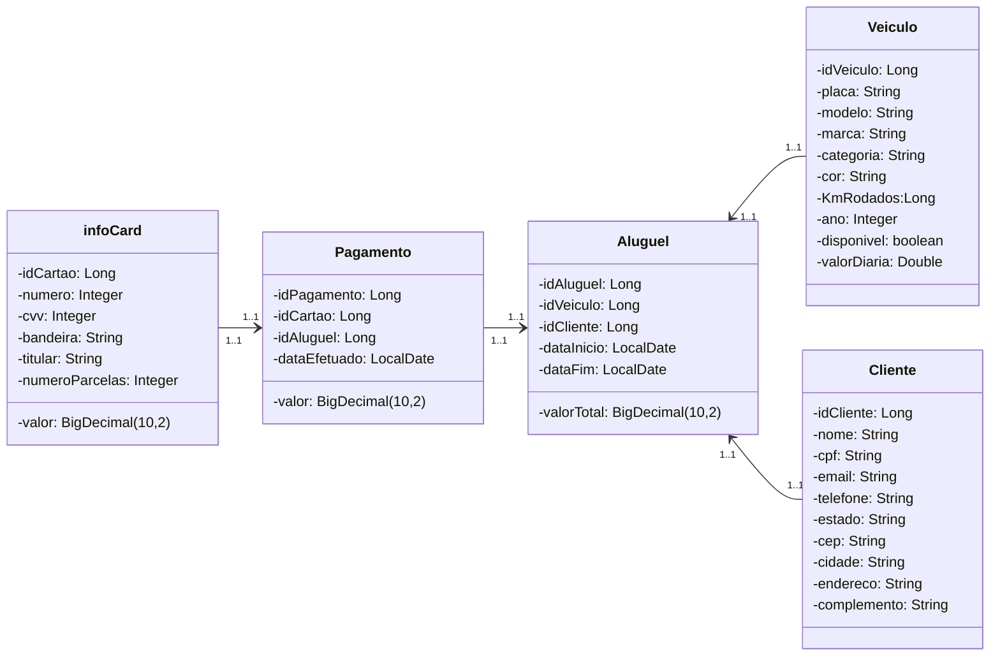

# Projeto-1-Api-Rest
 Publicando minha API REST na Nuvem Usando Spring Boot 3, Java 21 e Railway

## Diagrama de classes

```mermaid
classDiagram
    direction LR
    
    class Veiculo {
        -idVeiculo: Long
        -placa: String
        -modelo: String
        -marca: String
        -categoria: String
        -cor: String
        -KmRodados:Long
        -ano: Integer
        -disponivel: boolean
        -valorDiaria: Double
    }

    class Cliente {
        -idCliente: Long
        -nome: String
        -cpf: String
        -email: String
        -telefone: String
        -estado: String
        -cep: String
        -cidade: String
        -endereco: String
        -complemento: String
    }
    
    class Pagamento {
        -idPagamento: Long
        -idCartao: Long
        -idAluguel: Long
        -dataEfetuado: LocalDate
        -valor: BigDecimal(10,2)
    }

    class infoCard {
        -idCartao: Long
        -numero: Integer
        -cvv: Integer
        -bandeira: String
        -titular: String
        -numeroParcelas: Integer
        -valor: BigDecimal(10,2)
    }

    class Aluguel {
        -idAluguel: Long
        -idVeiculo: Long
        -idCliente: Long
        -dataInicio: LocalDate
        -dataFim: LocalDate
        -valorTotal: BigDecimal(10,2)
    }
    infoCard "1..1" --> "1..1" Pagamento
    Pagamento "1..1" --> "1..1" Aluguel
    Aluguel "1..1" <-- "1..1" Veiculo
    Aluguel "1..1" <-- "1..1" Cliente
```
